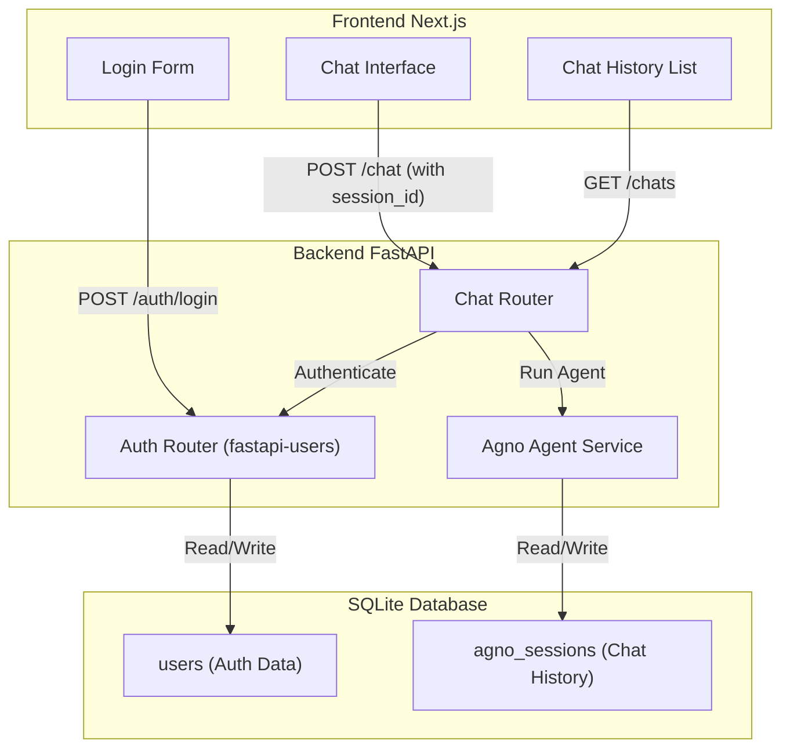

# Authentication and User-Scoped Chat Plan

This plan focuses on integrating `fastapi-users` for robust authentication and utilizing `Agno`'s native session management to link chats to users. This avoids creating redundant database tables for conversations and messages, as Agno handles this internally.

## Architecture Overview

## Step 1: Backend Authentication Setup

**Goal**: Implement user registration and login functionality.

1.  **Install Dependencies**: Add `fastapi-users[sqlalchemy] `and `aiosqlite` to `backend/pyproject.toml`.
2.  **Define User Model**: Create [`backend/app/db.py`](backend/app/db.py) (new file) to define the `User` model inheriting from `SQLAlchemyBaseUserTable`.
3.  **Configure Auth**: Create [`backend/app/users.py`](backend/app/users.py) (new file) to set up the `UserManager`, `fastapi_users` instance, and JWT authentication backend.
4.  **Register Routes**: Update [`backend/main.py`](backend/main.py) to include the auth routers (`/auth/register`, `/auth/login`, `/auth/logout`).

## Step 2: Agno Session Management

**Goal**: Configure Agno to persist sessions in the database.

1.  **Update Agent Configuration**: Modify [`backend/main.py`](backend/main.py) (or a new `backend/app/agent.py`) to initialize `SqliteDb` globally.
2.  **Refactor Chat Endpoint**: Update the chat endpoint to accept a `session_id`.

    -   **Important**: When initializing the `Agent` for a request, pass the `user_id` (from the authenticated user) and `session_id`. This ensures Agno scopes the session correctly.

3.  **Implement List Chats Endpoint**: Create a new endpoint `GET /api/chats` that uses `db.get_sessions(user_id=current_user.id)` to return the list of past conversations for the logged-in user.

## Step 3: Frontend Integration

**Goal**: Connect the frontend to the new auth and chat endpoints.

1.  **Auth Context**: Create a React Context (`AuthProvider`) to handle login state and store the access token.
2.  **Login/Register Pages**: Create simple forms for Login and Registration using existing UI components.
3.  **Protected Route Wrapper**: Create a component to redirect unauthenticated users to the login page.
4.  **Update Chat UI**:

    -   Fetch the list of chats on load using the new `GET /api/chats`.
    -   When starting a chat, generate a new `session_id` (or let the backend do it).
    -   Pass the auth token in the headers of all API requests.

## Checklist