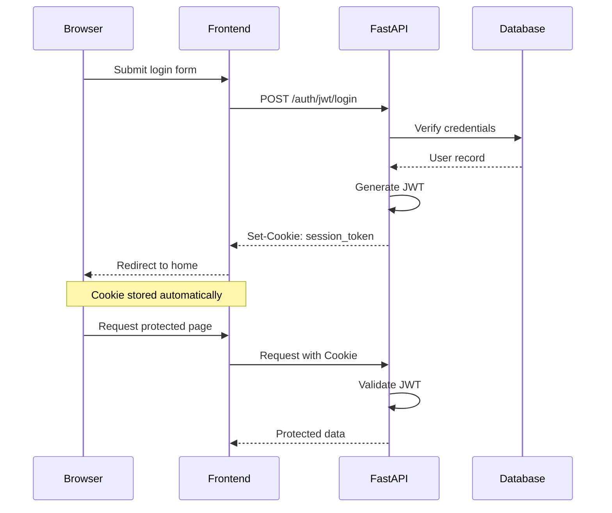
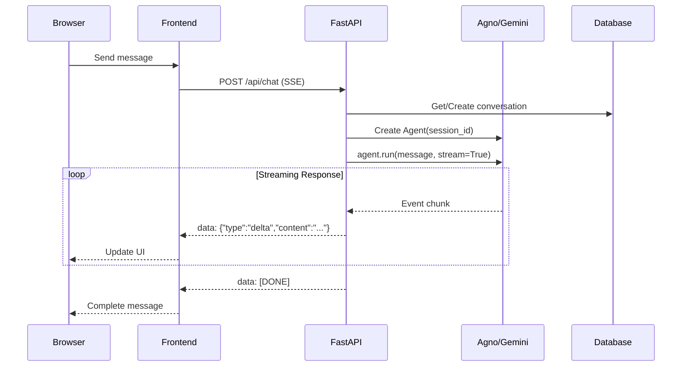
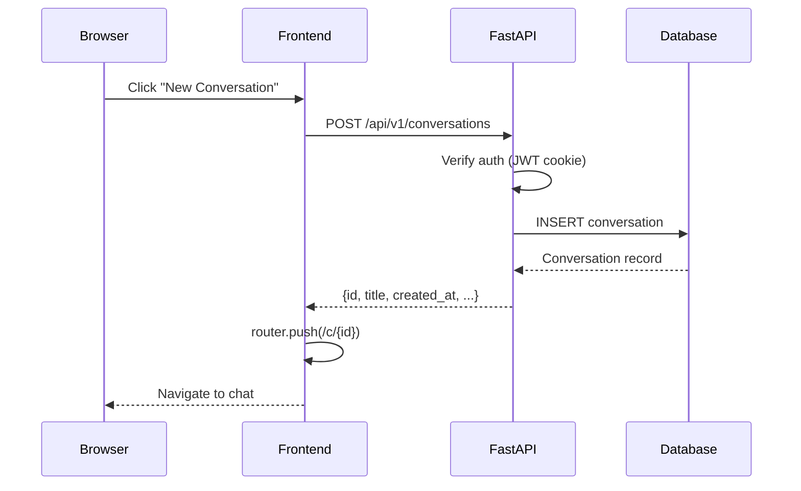

# AI Nexus Architecture

Technical architecture documentation for the AI Nexus application.

## System Overview

AI Nexus is a "second brain" chatbot application featuring real-time streaming responses powered by Google's Gemini model through the Agno agent framework.

```
┌─────────────────────────────────────────────────────────────────────────┐
│                              AI Nexus                                   │
├─────────────────────────────────────────────────────────────────────────┤
│                                                                         │
│   ┌─────────────┐         ┌─────────────┐         ┌─────────────┐      │
│   │   Browser   │◄──────►│   Next.js   │◄──────►│   FastAPI   │      │
│   │   Client    │  HTTP   │   Frontend  │  REST   │   Backend   │      │
│   └─────────────┘         │   :3001     │  SSE    │   :8000     │      │
│                           └─────────────┘         └──────┬──────┘      │
│                                                          │              │
│                                                          ▼              │
│                           ┌─────────────┐         ┌─────────────┐      │
│                           │   SQLite    │◄──────►│    Agno     │      │
│                           │   agno.db   │         │   + Gemini  │      │
│                           └─────────────┘         └─────────────┘      │
│                                                                         │
└─────────────────────────────────────────────────────────────────────────┘
```

## Technology Stack

| Layer    | Technology         | Version | Purpose                          |
| -------- | ------------------ | ------- | -------------------------------- |
| Frontend | Next.js            | 16.1.6  | React framework with App Router  |
| Frontend | React              | 19.2.4  | UI library                       |
| Frontend | Tailwind CSS       | 4.1.18  | Utility-first styling            |
| Frontend | Radix UI           | Latest  | Accessible UI primitives         |
| Backend  | FastAPI            | 0.127+  | Async Python web framework       |
| Backend  | Python             | 3.13    | Backend runtime                  |
| AI       | Agno               | 2.3.21+ | Agent orchestration framework    |
| AI       | Google Gemini      | Latest  | Large language model             |
| Auth     | FastAPI-Users      | 15.0+   | Authentication & user management |
| Database | SQLite + aiosqlite | Latest  | Async SQLite for persistence     |
| ORM      | SQLAlchemy         | 2.0+    | Async ORM                        |
| Runtime  | Bun                | Latest  | JavaScript runtime & package mgr |
| Runtime  | uv                 | Latest  | Python package manager           |

## Component Architecture

### Frontend Components

```
frontend/
├── app/                          # Next.js App Router
│   ├── layout.tsx                # Root layout with providers
│   ├── page.tsx                  # Landing page
│   ├── login/page.tsx            # Login page
│   ├── signup/page.tsx           # Signup page
│   └── c/[conversationId]/       # Dynamic chat route
│       └── page.tsx
│
├── components/
│   ├── chat/
│   │   └── chat.tsx              # Main chat interface
│   │
│   ├── ai-elements/              # AI-specific UI components
│   │   ├── message.tsx           # Message bubble
│   │   ├── conversation.tsx      # Message container
│   │   ├── prompt-input.tsx      # Input field
│   │   ├── loader.tsx            # Loading indicator
│   │   ├── code-block.tsx        # Syntax highlighting
│   │   └── ... (30+ components)
│   │
│   ├── ui/                       # Generic UI primitives
│   │   ├── button.tsx
│   │   ├── card.tsx
│   │   ├── input.tsx
│   │   └── ... (30+ components)
│   │
│   ├── login-form.tsx            # Login form
│   └── signup-form.tsx           # Registration form
│
├── hooks/
│   ├── use-chat.ts               # SSE streaming hook
│   ├── use-authed-fetch.ts       # Authenticated fetcher
│   ├── use-create-conversation.ts# Conversation creation
│   └── use-mobile.ts             # Responsive detection
│
└── lib/
    ├── api.ts                    # API endpoint definitions
    └── utils.ts                  # Utility functions
```

### Backend Components

```
backend/
├── main.py                       # FastAPI application entry
│   ├── CORS middleware
│   ├── Auth routers (login, register)
│   ├── /api/v1/conversations     # Conversation CRUD
│   └── /api/chat                 # Streaming chat endpoint
│
└── app/
    ├── db.py                     # Database setup
    │   ├── SQLAlchemy engine
    │   ├── Session factory
    │   └── User model (FastAPI-Users)
    │
    ├── models.py                 # SQLAlchemy models
    │   ├── Conversation
    │   └── Message
    │
    ├── schemas.py                # Pydantic schemas
    │   ├── UserRead, UserCreate, UserUpdate
    │   ├── ConversationCreate, ConversationResponse
    │   └── ChatRequest, ChatResponse
    │
    ├── users.py                  # Authentication setup
    │   ├── UserManager
    │   ├── CookieTransport
    │   └── JWTStrategy
    │
    └── crud/
        ├── conversation.py       # Conversation operations
        └── message.py            # Message operations
```

## Data Flow

### Authentication Flow



### Chat Streaming Flow



### Conversation Creation Flow



## Database Schema

### Entity Relationship Diagram

```
┌─────────────────────┐
│        User         │
├─────────────────────┤
│ id: UUID (PK)       │
│ email: VARCHAR      │
│ hashed_password     │
│ is_active: BOOL     │
│ is_superuser: BOOL  │
│ is_verified: BOOL   │
└─────────┬───────────┘
          │
          │ 1:N
          ▼
┌─────────────────────┐
│    Conversation     │
├─────────────────────┤
│ id: UUID (PK)       │
│ user_id: UUID (FK)  │──► User.id
│ title: VARCHAR(255) │
│ created_at: DATETIME│
│ updated_at: DATETIME│
└─────────┬───────────┘
          │
          │ 1:N
          ▼
┌─────────────────────┐
│      Message        │
├─────────────────────┤
│ id: UUID (PK)       │
│ conversation_id (FK)│──► Conversation.id
│ content: TEXT       │
│ sender: ENUM        │    (ai, user)
│ created_at: DATETIME│
└─────────────────────┘
```

### SQLAlchemy Models

```python
class User(SQLAlchemyBaseUserTableUUID, Base):
    """FastAPI-Users managed user table"""
    __tablename__ = "user"
    # Inherited: id, email, hashed_password, is_active, is_superuser, is_verified

class Conversation(Base):
    __tablename__ = "conversations"

    id: Mapped[UUID] = mapped_column(primary_key=True, default=uuid4)
    user_id: Mapped[UUID] = mapped_column(ForeignKey("user.id"))
    title: Mapped[str] = mapped_column(String(255))
    created_at: Mapped[datetime]
    updated_at: Mapped[datetime]

    messages: Mapped[list["Message"]] = relationship(back_populates="conversation")

class Message(Base):
    __tablename__ = "messages"

    id: Mapped[UUID] = mapped_column(primary_key=True, default=uuid4)
    conversation_id: Mapped[UUID] = mapped_column(ForeignKey("conversations.id"))
    content: Mapped[str] = mapped_column(Text)
    sender: Mapped[SenderType]  # Enum: AI, USER
    created_at: Mapped[datetime]

    conversation: Mapped["Conversation"] = relationship(back_populates="messages")
```

## Dual Database Architecture

AI Nexus uses a dual-database approach:

```
┌──────────────────────────────────────────────────────────────┐
│                       agno.db (SQLite)                       │
├──────────────────────────────────────────────────────────────┤
│                                                              │
│  ┌─────────────────────────┐  ┌──────────────────────────┐  │
│  │  Your Database Tables   │  │   Agno Database Tables   │  │
│  ├─────────────────────────┤  ├──────────────────────────┤  │
│  │ • user                  │  │ • agent_sessions         │  │
│  │ • conversations         │  │ • agent_memories         │  │
│  │ • messages (backup)     │  │ • tool_executions        │  │
│  └─────────────────────────┘  └──────────────────────────┘  │
│                                                              │
│  Managed by: SQLAlchemy       Managed by: Agno framework    │
│                                                              │
└──────────────────────────────────────────────────────────────┘
```

**Key Point:** The `conversation_id` from your database is used as the `session_id` for Agno, linking your conversation metadata with Agno's message history.

## Security Architecture

### Authentication Layers

```
┌────────────────────────────────────────────────────────────┐
│                    Security Layers                         │
├────────────────────────────────────────────────────────────┤
│                                                            │
│  1. HTTPS (Production)                                     │
│     └── Encrypted transport                                │
│                                                            │
│  2. CORS                                                   │
│     └── Origin: localhost:3001 only                        │
│                                                            │
│  3. JWT Cookie                                             │
│     ├── httpOnly: true (no JS access)                      │
│     ├── secure: true (prod only)                           │
│     ├── sameSite: lax (CSRF protection)                    │
│     └── maxAge: 3600s (1 hour)                             │
│                                                            │
│  4. FastAPI-Users                                          │
│     ├── Password hashing (bcrypt)                          │
│     └── User verification workflow                         │
│                                                            │
│  5. Endpoint Protection                                    │
│     └── Depends(current_active_user)                       │
│                                                            │
└────────────────────────────────────────────────────────────┘
```

### Known Security Considerations

| Issue                   | Status  | Impact | Mitigation Plan               |
| ----------------------- | ------- | ------ | ----------------------------- |
| Chat endpoint ownership | TODO    | High   | Verify user owns conversation |
| Rate limiting           | TODO    | Medium | Add slowapi middleware        |
| Input validation        | Partial | Low    | Add max_length constraints    |
| CORS production config  | TODO    | Medium | Environment-based origins     |

## Streaming Architecture

### Server-Sent Events (SSE)

```
Frontend                          Backend
   │                                 │
   │    POST /api/chat               │
   │    Content-Type: application/json
   │    Accept: text/event-stream    │
   │────────────────────────────────►│
   │                                 │
   │    HTTP/1.1 200 OK              │
   │    Content-Type: text/event-stream
   │    Transfer-Encoding: chunked   │
   │◄────────────────────────────────│
   │                                 │
   │    data: {"type":"delta",...}   │
   │◄────────────────────────────────│
   │                                 │
   │    data: {"type":"delta",...}   │
   │◄────────────────────────────────│
   │                                 │
   │    data: [DONE]                 │
   │◄────────────────────────────────│
   │                                 │
```

### Frontend Streaming Implementation

```typescript
// hooks/use-chat.ts
async function* streamMessage(message: string, conversationId: string) {
    const response = await fetch("/api/chat", {
        method: "POST",
        credentials: "include",
        headers: { "Content-Type": "application/json" },
        body: JSON.stringify({
            question: message,
            conversation_id: conversationId,
        }),
    });

    const reader = response.body
        .pipeThrough(new TextDecoderStream())
        .getReader();

    let buffer = "";

    while (true) {
        const { value, done } = await reader.read();
        if (done) break;

        buffer += value;
        const lines = buffer.split("\n\n");
        buffer = lines.pop() || "";

        for (const line of lines) {
            if (line.startsWith("data: ")) {
                const data = line.slice(6);
                if (data === "[DONE]") return;

                const parsed = JSON.parse(data);
                if (parsed.type === "delta") {
                    yield parsed.content;
                }
            }
        }
    }
}
```

### Backend Streaming Implementation

```python
# main.py
async def event_stream(question: str, user_id: UUID, conversation_id: UUID):
    agent = Agent(
        model=Gemini(id="gemini-2.0-flash-exp"),
        user_id=str(user_id),
        session_id=str(conversation_id),
        storage=AgentStorage(...)
    )

    response = agent.run(question, stream=True)

    for event in response:
        if hasattr(event, "content") and event.content:
            yield f"data: {json.dumps({'type': 'delta', 'content': event.content})}\n\n"

    yield "data: [DONE]\n\n"

@app.post("/api/chat")
async def chat(request: ChatRequest, user: User = Depends(current_active_user)):
    return StreamingResponse(
        event_stream(request.question, user.id, request.conversation_id),
        media_type="text/event-stream"
    )
```

## Deployment Architecture

### Development Setup

```
┌─────────────────────────────────────────────────────────────┐
│                   Development Environment                    │
├─────────────────────────────────────────────────────────────┤
│                                                             │
│   Terminal: bun dev                                         │
│                                                             │
│   ┌─────────────────┐        ┌─────────────────┐           │
│   │   Next.js Dev   │        │  FastAPI Dev    │           │
│   │   Server        │        │  Server         │           │
│   │   :3001         │◄──────►│  :8000          │           │
│   │   (hot reload)  │  CORS  │  (--reload)     │           │
│   └─────────────────┘        └────────┬────────┘           │
│                                       │                     │
│                                       ▼                     │
│                              ┌─────────────────┐           │
│                              │    agno.db      │           │
│                              │    (SQLite)     │           │
│                              └─────────────────┘           │
│                                                             │
└─────────────────────────────────────────────────────────────┘
```

### Production Considerations

```
┌─────────────────────────────────────────────────────────────┐
│                   Production Environment                     │
├─────────────────────────────────────────────────────────────┤
│                                                             │
│   ┌─────────────────┐        ┌─────────────────┐           │
│   │     CDN         │        │   Load Balancer │           │
│   │   (Vercel)      │        │   (nginx)       │           │
│   └────────┬────────┘        └────────┬────────┘           │
│            │                          │                     │
│            ▼                          ▼                     │
│   ┌─────────────────┐        ┌─────────────────┐           │
│   │   Next.js       │        │  FastAPI        │           │
│   │   Static +      │◄──────►│  + Uvicorn      │           │
│   │   Edge Funcs    │  API   │  Workers        │           │
│   └─────────────────┘        └────────┬────────┘           │
│                                       │                     │
│                                       ▼                     │
│                              ┌─────────────────┐           │
│                              │   PostgreSQL    │           │
│                              │   (Recommended) │           │
│                              └─────────────────┘           │
│                                                             │
└─────────────────────────────────────────────────────────────┘
```

## Environment Configuration

### Backend (.env)

```bash
# Required
AUTH_SECRET=your-super-secret-jwt-key
GOOGLE_API_KEY=your-gemini-api-key

# Optional
ENV=dev|prod                    # Controls secure cookie flag
DATABASE_URL=sqlite+aiosqlite:///./agno.db
```

### Frontend (.env)

```bash
# Required
NEXT_PUBLIC_API_URL=http://localhost:8000
```

## Performance Considerations

### Current Limitations

- SQLite single-writer constraint
- In-memory message state (no persistence on refresh)
- No pagination for conversations list
- No caching layer

### Recommended Optimizations

1. **Database:** Migrate to PostgreSQL for concurrent writes
2. **Caching:** Add Redis for session and response caching
3. **CDN:** Use Vercel or CloudFlare for static assets
4. **API:** Add pagination to list endpoints
5. **Frontend:** Implement virtual scrolling for long conversations
